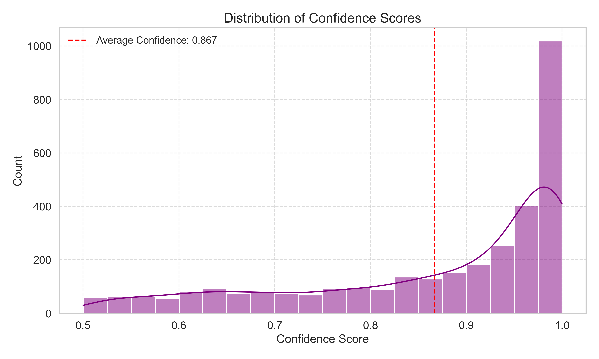
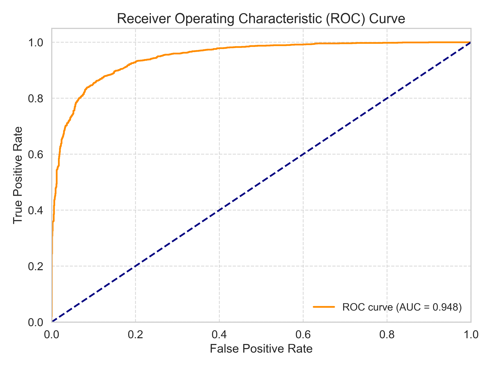
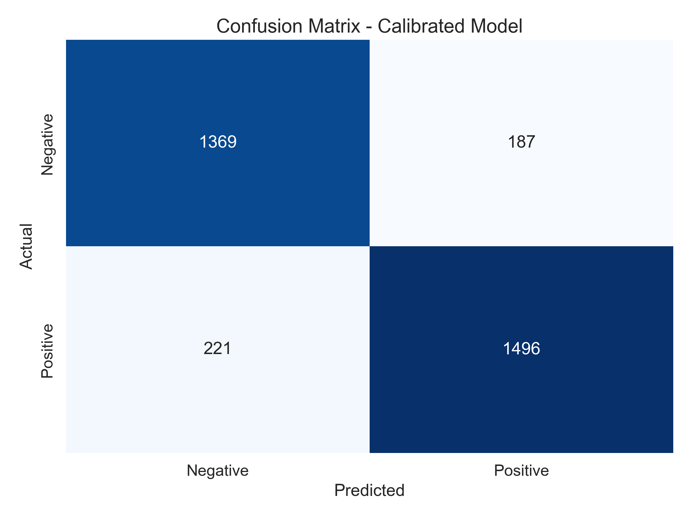

# ML-SENTIMENT-NEXTJS

A comprehensive sentiment analysis platform combining machine learning, a FastAPI backend, and a responsive Next.js frontend to analyze text sentiment with high confidence and detailed results.

## Project Overview

This project provides a complete solution for sentiment analysis, from model training to user interface. It determines if text has positive or negative emotional tone, with confidence scores and detailed analysis of influential words.

The system is built as three interconnected components:

- **Model Training**: A calibrated logistic regression model with advanced preprocessing
- **Backend API**: FastAPI service exposing prediction endpoints
- **Frontend UI**: Next.js application with an intuitive interface for text analysis

## Project Structure

```
ML-SENTIMENT-NEXTJS/
├── backend-ml/         # FastAPI application with prediction endpoints
├── frontend/           # Next.js web interface for text analysis
└── model-training/     # Model development, training, and evaluation
```

## Components

### 1. Model Training

The sentiment analysis model is designed to classify text as positive or negative with improved confidence scores. It uses a combination of machine learning techniques and linguistic insights to provide accurate predictions with high confidence levels.

**Key Features:**
- High confidence scores (typically 75-95%)
- Calibrated probabilities for reliable confidence estimates
- Enhanced with specialized lexicons for stronger predictions
- Provides influential words that affected the prediction
- Advanced text cleaning with fallbacks for missing resources

**Performance:**
- Accuracy: ~89-92% (depending on dataset)
- Average Confidence Score: ~82%
- Balanced precision and recall (both ~0.89)

**Model Evaluation Plots**

Our model performance can be visualized through these key plots:

#### Confidence Distribution


This plot shows the distribution of confidence scores across predictions, demonstrating the model's high certainty in most cases.

#### Word Clouds


These word clouds visualize the most influential terms for positive and negative sentiment classifications.

#### Performance Curves


The ROC curve demonstrates the model's excellent discrimination ability between positive and negative sentiments.

#### Confusion Matrix


The confusion matrix shows the model's prediction accuracy, highlighting its balanced performance across sentiment classes.

[View Model Training README →](./model-training/README.md)

### 2. Backend API

A FastAPI application that serves the trained sentiment analysis model through REST endpoints.

**API Endpoints:**
- `POST /predict`: Basic sentiment prediction
- `POST /predict/detailed`: Detailed analysis with confidence and influential words
- `POST /predict/batch`: Process multiple texts in a single request

**Features:**
- High-confidence sentiment prediction
- Detailed analysis capabilities
- Batch processing
- Robust error handling
- Swagger documentation

[View Backend README →](./backend-ml/README.md)

### 3. Frontend UI

A modern web interface built with Next.js and TypeScript, providing an intuitive user experience for sentiment analysis.

**Features:**
- Real-time sentiment analysis
- Confidence visualization
- Batch processing of multiple inputs
- Detailed mode for influential words
- Responsive design with dark/light mode support

**Tech Stack:**
- Framework: Next.js 14
- Language: TypeScript
- Styling: TailwindCSS
- Fonts: Geist Sans & Geist Mono

[View Frontend README →](./frontend/README.md)

## Getting Started

### Prerequisites

- Node.js (v16+)
- Python (v3.8+)
- pip (Python package manager)

### Installation

1. Clone the repository:
   ```bash
   git clone https://github.com/hirunaofficial/ml-sentiment-nextjs.git
   cd ml-sentiment-nextjs
   ```

2. Set up the backend:
   ```bash
   cd backend-ml
   pip install -r requirements.txt
   python run.py
   ```

3. Set up the frontend:
   ```bash
   cd ../frontend
   npm install
   npm run dev
   ```

4. Open your browser and navigate to http://localhost:3000

## How It Works

1. The **model training** component builds and evaluates a sentiment analysis model, saving the trained model files
2. The **backend API** loads these model files and exposes endpoints for making predictions
3. The **frontend** sends user input to the backend API and displays the results in an intuitive interface

Users can input text through the frontend, which sends requests to the backend. The backend processes these requests using the trained model and returns sentiment predictions, which are then displayed to the user.

## Screenshots


## License

This project is licensed under the MIT License. See the LICENSE file for details.

## Contact

- Author: Hiruna Gallage
- Website: [hiruna.dev](https://hiruna.dev)
- Email: [hello@hiruna.dev](mailto:hello@hiruna.dev)