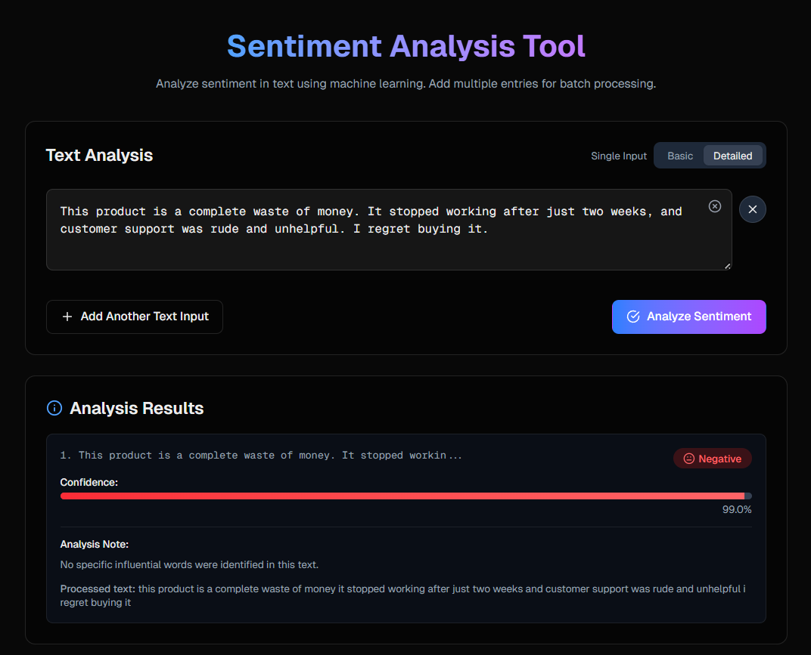

# Sentiment Analysis Frontend

A modern web interface for text sentiment analysis, built with Next.js and TypeScript. This application provides an intuitive UI for analyzing the emotional tone of text input through machine learning.



## Features

- **Real-time Sentiment Analysis**: Instantly determine if text has positive or negative sentiment
- **Confidence Visualization**: See the confidence level of analysis with a visual indicator
- **Batch Processing**: Analyze multiple text inputs simultaneously
- **Detailed Mode**: View influential words that affect sentiment scores
- **Responsive Design**: Works seamlessly across desktop and mobile devices
- **Dark/Light Mode Support**: Automatic theme switching based on system preferences

## Tech Stack

- **Framework**: Next.js 14
- **Language**: TypeScript
- **Styling**: TailwindCSS
- **Fonts**: Geist Sans & Geist Mono
- **State Management**: React Hooks

## Component Structure

```
/app
  /components
    /layout          # Page structure components
    /analysis        # Core sentiment analysis components
    /ui              # Reusable UI elements
    /api-reference   # API documentation components
  /hooks             # Custom React hooks
  /utils             # Utility functions
  /types             # TypeScript type definitions
```

## License

This project is licensed under the MIT License. See the LICENSE file for details.

## Contact

- Author: Hiruna Gallage
- Website: [hiruna.dev](https://hiruna.dev)
- Email: [hello@hiruna.dev](mailto:hello@hiruna.dev)