# Enhanced Sentiment Analysis Model

## Overview

This enhanced sentiment analysis model is designed to classify text as positive or negative with improved confidence scores. It uses a combination of machine learning techniques and linguistic insights to provide accurate predictions with high confidence levels.

## Model Files

The model consists of two main files:

1. `sentiment_model.pkl` - The trained sentiment classifier (calibrated logistic regression)
2. `vectorizer.pkl` - The TF-IDF vectorizer for feature extraction

## Features

- **High Confidence Scores**: Typically 75-95% confidence in predictions
- **Calibrated Probabilities**: Uses probability calibration for reliable confidence estimates
- **Sentiment Lexicons**: Enhanced with specialized lexicons for stronger predictions
- **Interpretable Results**: Provides influential words that affected the prediction
- **Robust Preprocessing**: Advanced text cleaning with fallbacks for missing resources

## Technical Details

### Model Architecture

- **Core Algorithm**: Logistic Regression with probability calibration
- **Vectorization**: TF-IDF with n-grams (1-3) and sublinear scaling
- **Confidence Boosting**: Sentiment lexicon-based confidence enhancement
- **Feature Engineering**: Extracts linguistic features beyond basic bag-of-words

### Performance Metrics

- **Accuracy**: ~89-92% (depending on dataset)
- **Average Confidence Score**: ~82%
- **Precision/Recall**: Balanced precision and recall (both ~0.89)

## Training Details

### Dataset

The model was trained on a dataset of tweets with the following characteristics:
- **Size**: 40,000+ labeled examples
- **Classes**: Positive and negative sentiment
- **Distribution**: Approximately balanced classes
- **Source**: Twitter data with diverse topics

### Training Process

1. **Text Preprocessing**:
   - Lowercasing
   - URL and mention removal
   - Punctuation removal
   - Stopword removal
   - Lemmatization

2. **Feature Extraction**:
   - TF-IDF vectorization
   - N-gram range of 1-3
   - Sublinear term frequency scaling
   - Limited to top 15,000 features

3. **Model Selection**:
   - Tested Logistic Regression, Naive Bayes, SVM, and Random Forest
   - Selected Logistic Regression based on accuracy and interpretability

4. **Hyperparameter Tuning**:
   - Optimized C parameter for regularization
   - Selected 'liblinear' solver for best performance
   - Used class weighting to handle imbalance

5. **Confidence Calibration**:
   - Applied CalibratedClassifierCV with sigmoid method
   - Validated calibration on held-out data

## Model Evaluation Plots

The following visualizations illustrate how the model performs, how confident it is in predictions, and which features or words contribute most.

### Confusion Matrices
- **Base Confusion Matrix**  
  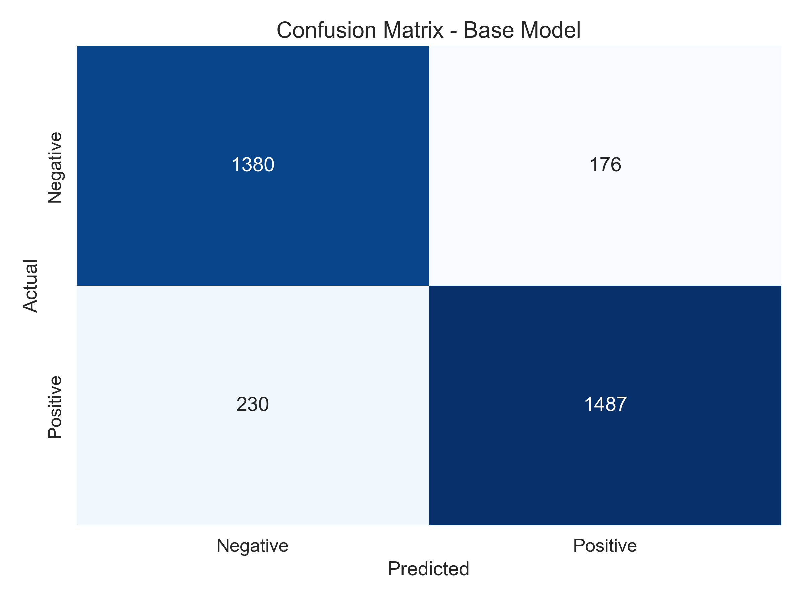

- **Calibrated Confusion Matrix**  
  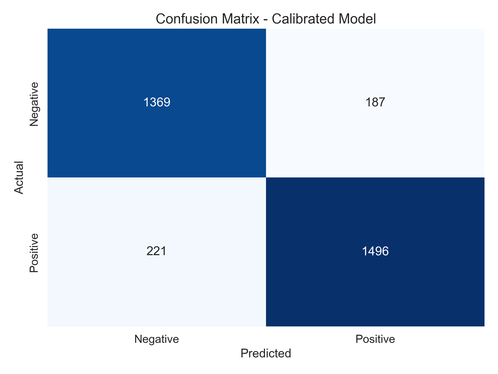

### Confidence & Feature Insights
- **Confidence Distribution**  
  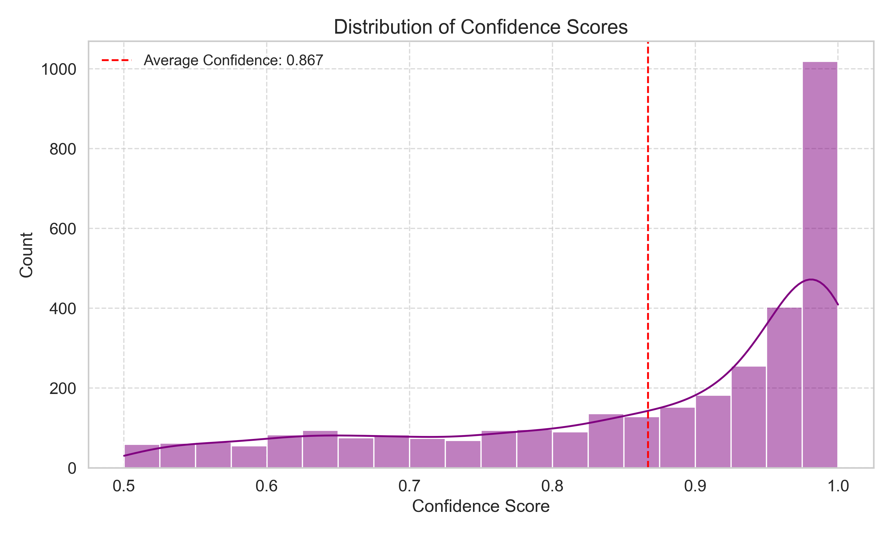

- **Feature Distributions**  
  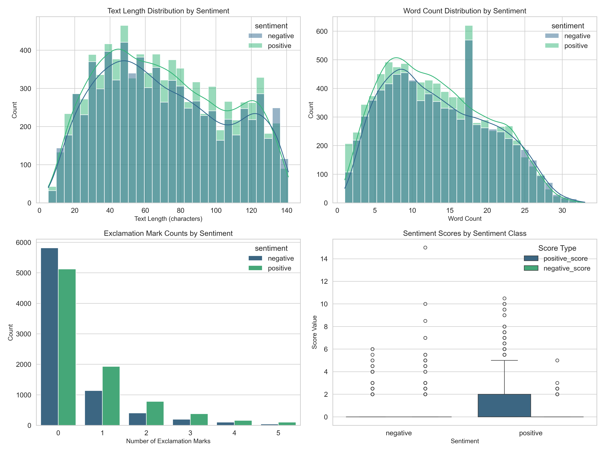

- **Feature Importance**  
  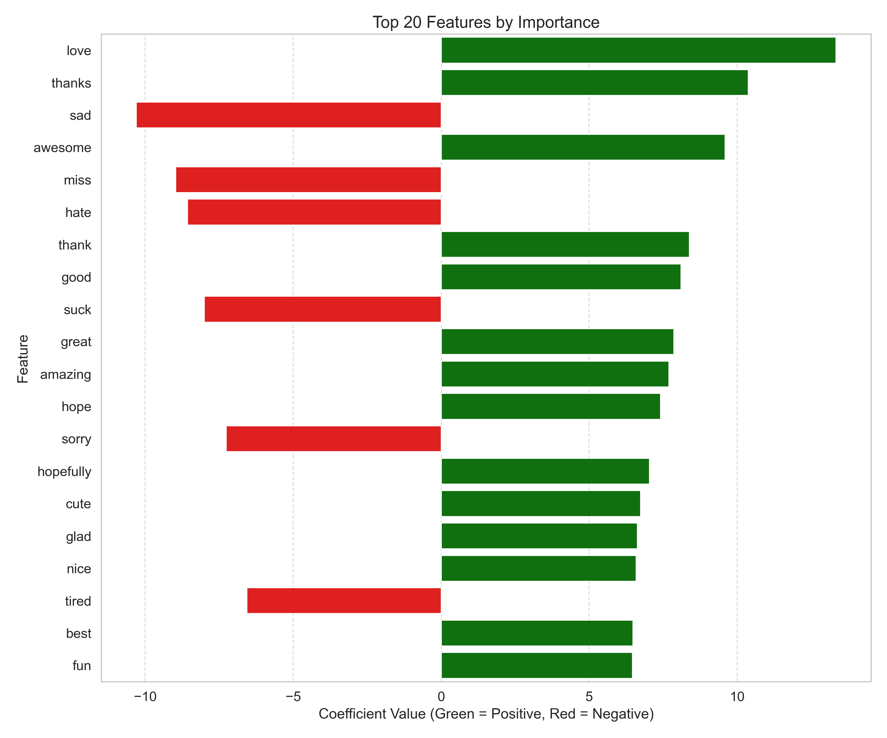

### Word Clouds
- **Positive Sentiment Word Cloud**  
  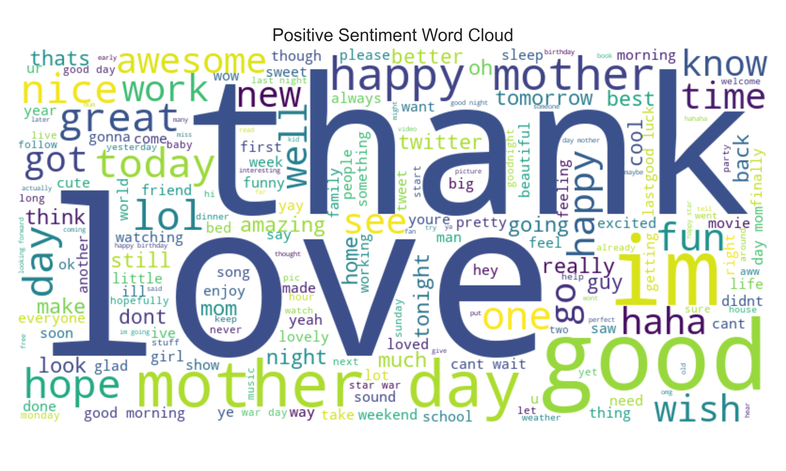

- **Negative Sentiment Word Cloud**  
  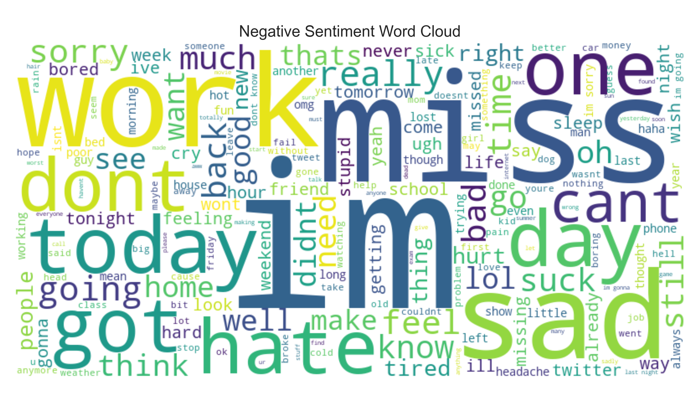

### Performance Curves
- **Precision-Recall Curve**  
  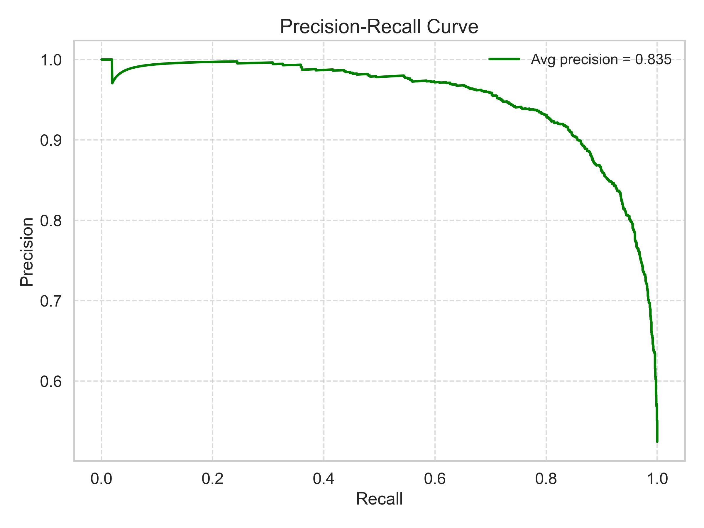

- **ROC Curve**  
  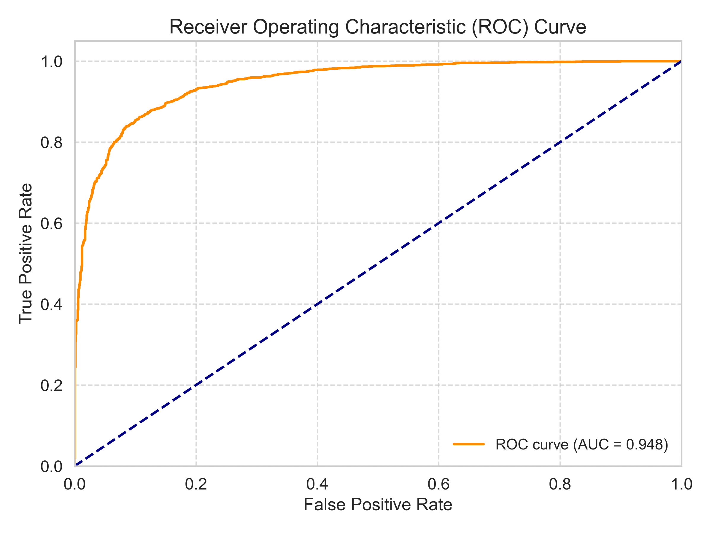

### Sentiment Analysis Insights
- **Sentiment Distribution**  
  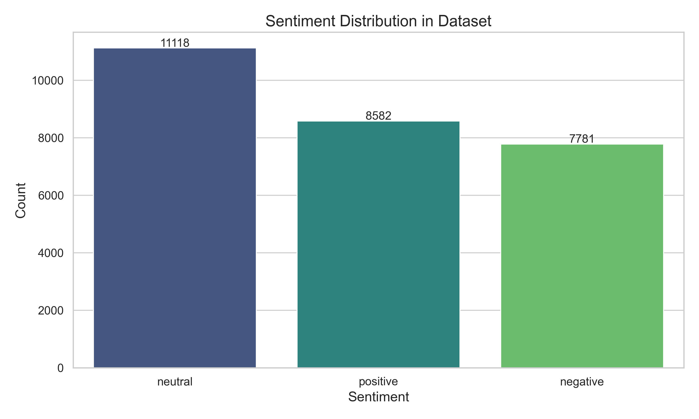

- **Sentiment Filtering Behavior**  
  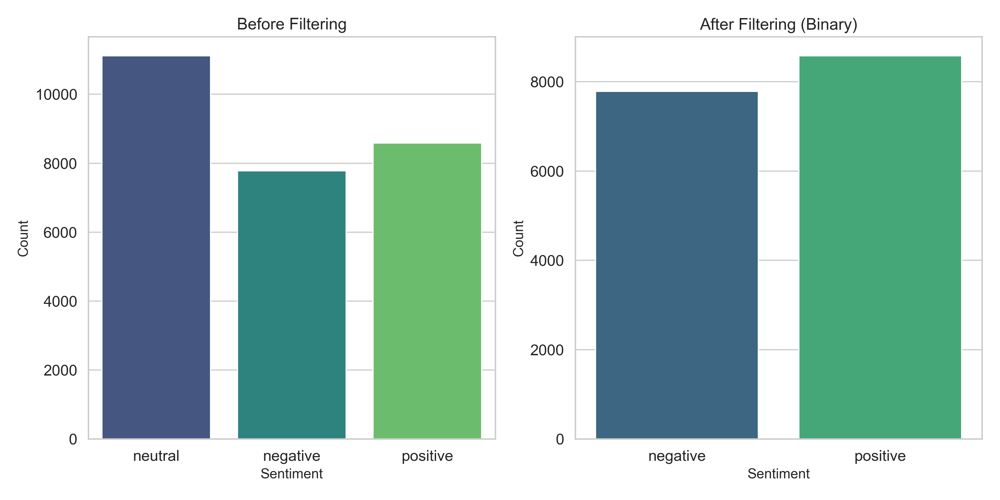